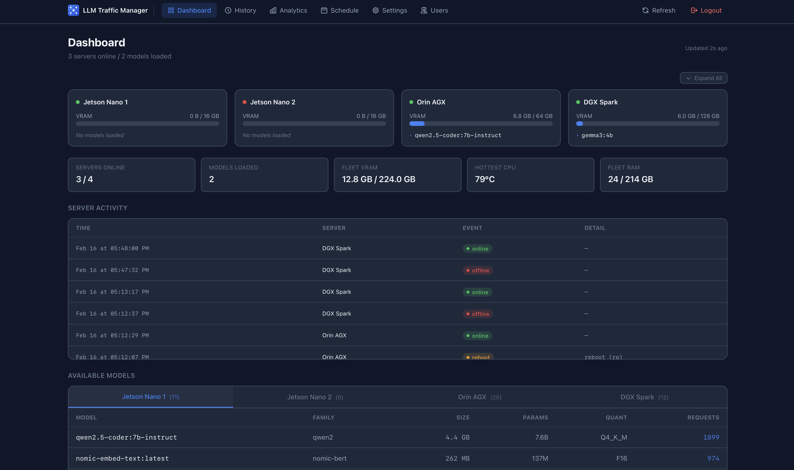

# LLM Traffic Manager

[](https://github.com/vpontual/llm-traffic-manager/actions/workflows/ci.yml)
[](LICENSE)
[](https://nodejs.org/)

A dashboard and intelligent proxy for managing a fleet of [Ollama](https://ollama.com) GPU servers. Monitor server status, route requests to the best available server, track usage analytics, and schedule model operations, all from a single interface.

<!-- TODO: Add screenshot of dashboard here -->
<!--  -->

## Features

- **Real-time Fleet Monitoring** - Server status, loaded models, VRAM usage, and system metrics
- **Intelligent Request Routing** - Routes to the best server: model loaded > model on disk > most free VRAM
- **Request Aggregation** - `/api/tags`, `/api/ps`, and `/v1/models` combine responses from all servers
- **Usage Analytics** - Model load times, duration, and frequency tracking
- **System Metrics** - CPU/GPU temperature, memory, disk, and uptime monitoring
- **Scheduled Jobs** - Cron-based model scheduling with conflict detection
- **Multi-User Auth** - Cookie-based sessions with per-user notification preferences
- **Telegram Alerts** - Server offline/online, overheating, low memory, and reboot notifications
- **Plugin System** - Extensible architecture for community plugins
- **OpenAI API Compatible** - Supports `/v1/*` endpoints

## Quick Start

```bash
git clone https://github.com/vpontual/llm-traffic-manager.git
cd llm-traffic-manager
cp .env.example .env
# Edit .env with your Ollama server addresses (see Configuration below)
docker compose up -d
```

Dashboard: **http://localhost:3334** (create admin account on first visit)
Proxy: **http://localhost:11434** (point your Ollama clients here)

## Configuration

Edit `.env` (or copy from `.env.example`):

```env
# Ollama servers to monitor and route to (JSON array)
OLLAMA_SERVERS='[
  {"name": "GPU Server 1", "host": "192.168.1.100:11434", "ramGb": 16},
  {"name": "GPU Server 2", "host": "192.168.1.101:11434", "ramGb": 24}
]'

# PostgreSQL (used by docker-compose)
POSTGRES_USER=ollama_fleet
POSTGRES_PASSWORD=replace-with-strong-postgres-password
POSTGRES_DB=ollama_fleet
DATABASE_URL=postgresql://ollama_fleet:replace-with-strong-postgres-password@db:5432/ollama_fleet

# Admin credentials (seeds first user on initial setup)
ADMIN_USERNAME=admin
ADMIN_PASSWORD=replace-with-strong-admin-password

# Optional
POLL_INTERVAL=10
TELEGRAM_BOT_TOKEN=
TELEGRAM_CHAT_ID=
SOURCE_NAMES='{"172.28.0.1": "my-app"}'
```

## Ports

| Port | Service |
|------|---------|
| 3000 | Dashboard (3334 via Docker) |
| 11434 | Proxy Server |
| 5432 | PostgreSQL (5434 via Docker) |

## Documentation

- [Architecture](docs/ARCHITECTURE.md) - How the system works, tech stack, database schema
- [API Reference](docs/API.md) - Dashboard and proxy endpoints
- [Plugin Guide](docs/PLUGINS.md) - Plugin system and fleet-metrics agent setup
- [Testing Guide](docs/TESTING.md) - Running tests, smoke tests, CI setup
- [Contributing](CONTRIBUTING.md) - Development setup, code style, pull request guidelines

## License

[MIT](LICENSE)
